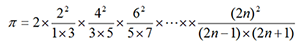

# Exercise 7:循环结构程序设计

## Purpose
1. 掌握while语句、do-while语句和for语句的功能，能够用这些语句实现循环结构程序设计。
2. 掌握循环语句嵌套使用的基本形式，能够用循环语句实现多重循环。
3. 掌握在循环结构程序中使用break语句和continue语句改变程序流程的方法。
4. 能够用循环实现累加、累乘、穷举、迭代等常用算法。
5. 学会程序调试（课堂举例讲解）

## Problem List
1. 编写程序，求100以内的奇数和，即：sum=1+3+5+ … +99,分别使用while循环语句和do-while循环语句;
2. 编写程序，在100-200之间找到满足用除3余2,用5除余3和用7除余2的所有整数;
3. 已知XYZ+YZZ=532,其中X,Y和Z都是数字,编写程序求出X,Y和Z的值;
4. 编程序，输出以下图形.
    并思考以下问题:  
    (1) 如果输出10行的图形，应如何修改程序?  
    (2) 如果输出图形向右平移25个字符位置，程序应该如何修改?
    ```
    *********
     *******
      *****
       ***
        *       
        
    *****
    ****
    ***
    **
    *

    1
    13
    135
    1357
    13579

    A
    BBB
    CCCCC
    DDDDDDD
    CCCCC
    BBB
    A
    ```

5. 编写一个程序，统计输出各位数之和为9，且能被5整除的五位数的个数。
   思考:表述“n能被5整除”的条件表达式唯一吗？试写出2种以上.  
6. 编写一个程序，求s=4!+6!+8! .  
7. 编写一个程序，求出1~1000之间的所有完全数。所谓完全数是指：该数的各因子之和正好等于该数本身，如6=1+2+3。
8. 计算π的近似值，π的计算公式为：  
    
  要求：精度为10^(-5)，并输出n的大小
9. 用do while循环输出两个数的最大公约数和最小公倍数.